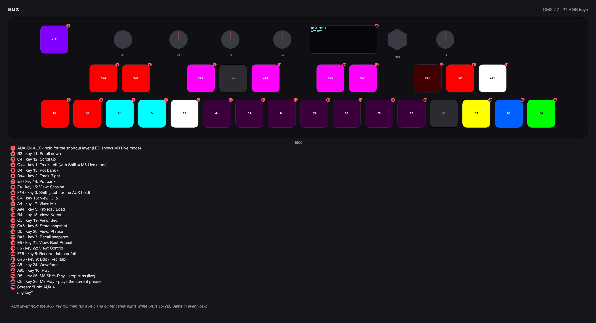
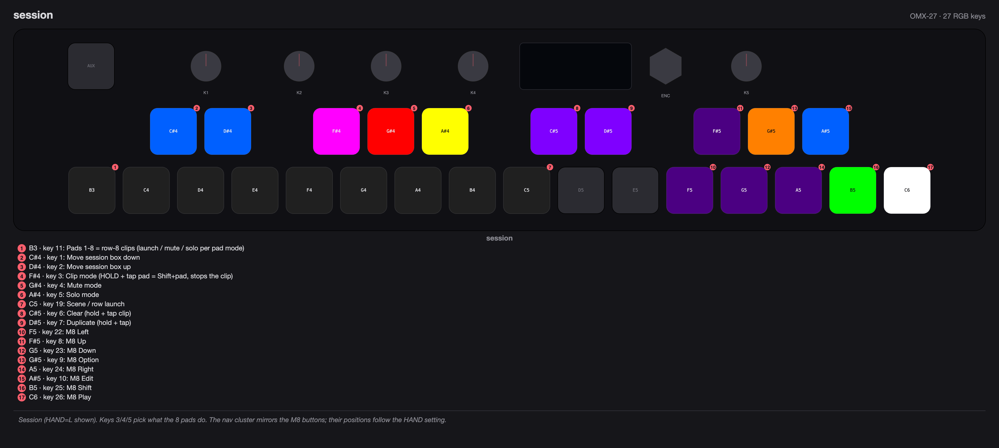
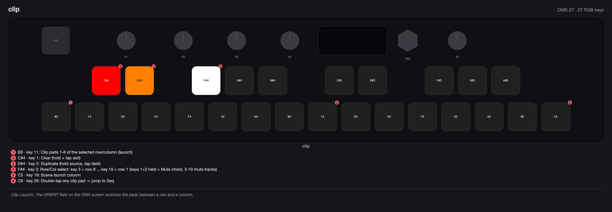
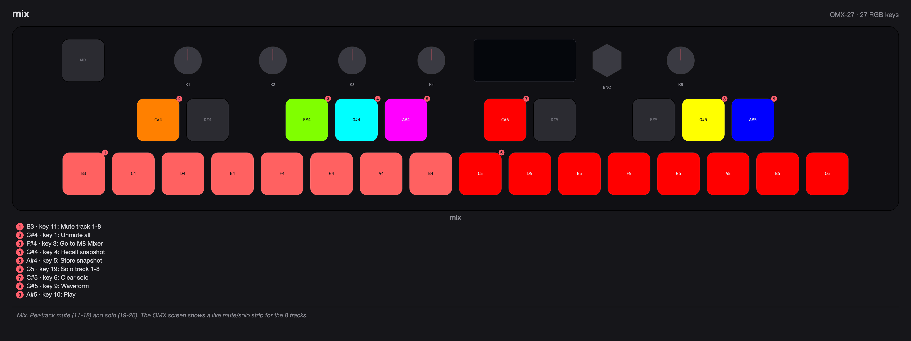
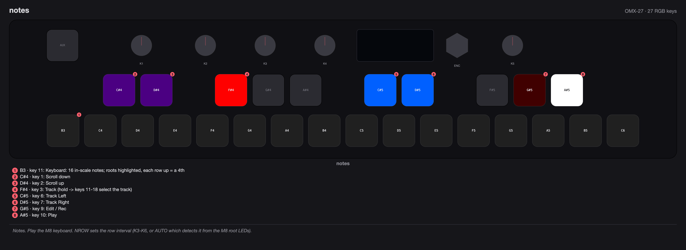
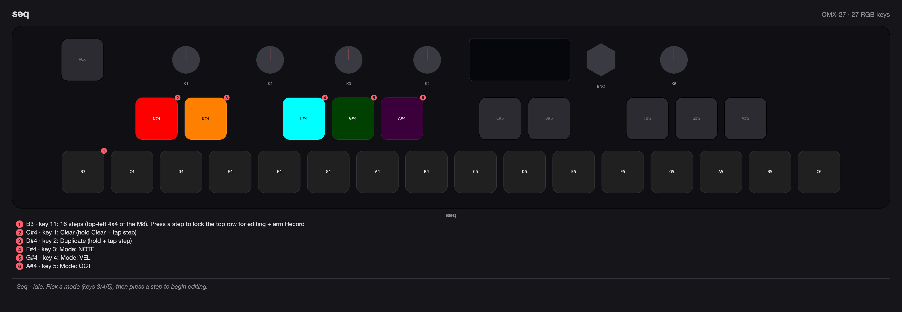
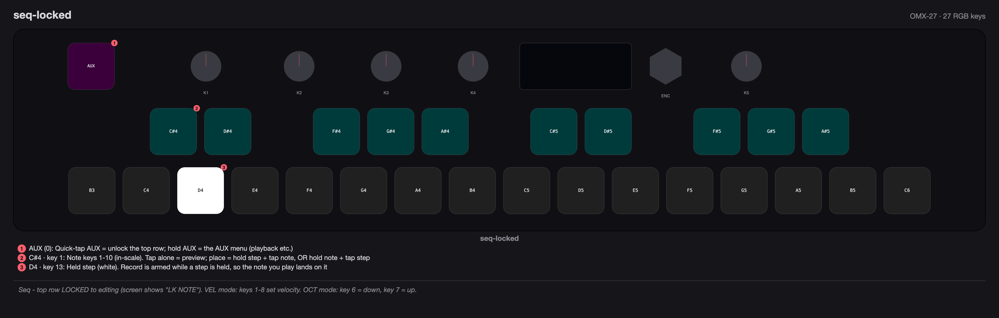
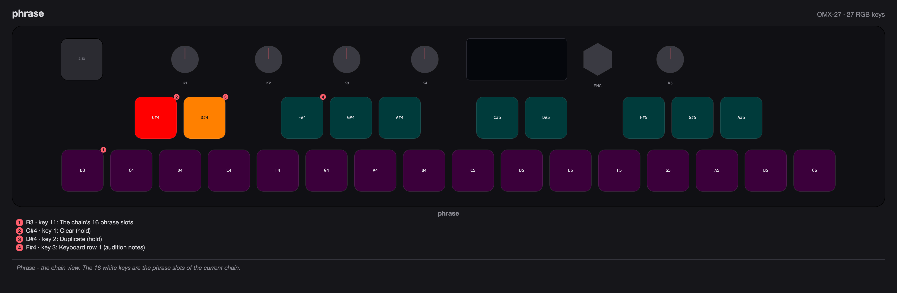
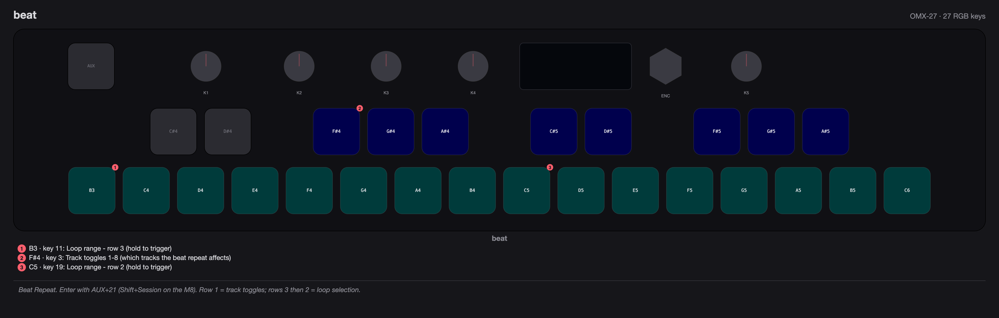
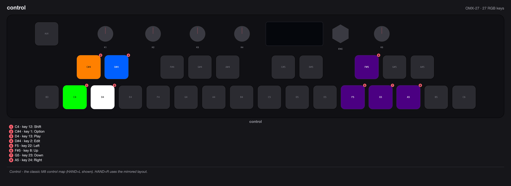

# OMX-27 ML Macro (M8 Launchpad Pro) — User Guide

The **ML** macro turns the OMX-27 into a Novation Launchpad Pro for the Dirtywave M8: the M8 (hardware or the iOS app) paints the OMX's LEDs, and the OMX's keys play, sequence and navigate the M8. It works over **USB** (including the iOS app via a USB-C / camera adapter) and over the **hardware TRS/DIN MIDI ports**.

> Each view below includes a faceplate map showing what every key does (generated with the OMX-27 LED Designer; the source PNGs are also in `design/m8v2/doc-images/`). The per-view tables give the exact per-key functions.

## Setup

1. **On the OMX:** set the `MCRO` parameter to `ML` (MIDI mode page 4, or CONFIG mode → MIDI). `M8` is the classic mute/solo macro and still works as before. Set `M-CH` to the channel you use for the M8's Control Map (default 10).
2. **Save and power-cycle.** When `ML` is the *saved* macro, the OMX enumerates over USB as a Novation "Launchpad Pro MK3" — the name the M8 app looks for. If you later pick a different macro, save and power-cycle again and the OMX goes back to `omx-27-v3`. (A convenient way to flash firmware is to save with the macro **off** first, so the OMX enumerates normally for PlatformIO.)
3. **On the M8:** MIDI Settings → `CTRL SURFACE` = `LAUNCHPAD PRO`. For the OMX's navigation keys, also set the Control Map channel to match `M-CH`.
4. **Connect** the OMX to the M8 (or phone/iPad):
   - **USB:** just plug in.
   - **TRS/DIN:** wire OMX MIDI **OUT → M8 IN** and M8 **OUT → OMX IN**. Set the OMX's **A/B TRS polarity switch to B** for Type-A gear (the M8 and most USB-MIDI interfaces). The control surface uses only SysEx over DIN, so the USB name doesn't matter on the hardware path.
5. **Enter the macro:** in MI, DRUM, CHORDS or FORM mode, double-click AUX. Double-click AUX again to leave.

The screen shows `WAIT S<n> R<n>` until the M8 answers (S = identity replies sent, R = inquiries received), then `LPP LINK`. Once linked, the M8 paints the OMX keys with its own colours and the macro **lands in Session view**.

**Terminology.** *LPP* = a Launchpad Pro button or pad (what the OMX pretends to be, sent on channel 1). *M8 Key* = one of the M8's own physical buttons (Play, Shift, Edit, Option, arrows), driven over the M8 Control Map on `M-CH`. Note the two different Shifts: the **LPP Shift** (AUX+3) is the Launchpad modifier; the **M8 Key Shift** in the nav clusters presses the M8's own Shift.

**Messages.** Most shortcuts flash a short confirmation on the OLED (`SHIFT ON`, `PROJECT`, `MUTE MODE`, `M8 PLAY`, `SEQ UNLOCK`, …). The scroll keys stay silent so the 8×8 grid stays visible while you scroll.

## Views

Hold **AUX** and press a key (see the AUX layer) to switch views — this also switches the M8's own Launchpad view. Mix is an OMX-side overlay (the M8 stays on Session). Control is pure M8 Control Map (nothing to the Launchpad).

| AUX + key | View | Purpose |
|---|---|---|
| 15 | Session | Clip launch + track pads; left/right-hand layout (HAND param) |
| 16 | Clip Launch | Launch clips a row or a column at a time (orientation is a page-1 param) |
| 17 | Mix | Track mute/solo overview without leaving M8 Session |
| 18 | Notes | Keyboard: 16 in-scale notes, track select, Edit/Play |
| 19 | Seq | Step editor: lock a step, place notes/velocity/octave |
| 20 | Phrase | The current chain's 16 phrase slots |
| 21 | Beat Repeat | Beat loop (hold pads to loop a range) — **M8 must be playing** |
| 22 | Control | M8 Control Map (arrows, Option, Edit, Shift, Play) |

## AUX layer (hold AUX)

Identical in every view. The **current view lights white** (keys 15–22).

| Key | Function |
|---|---|
| 1 / 2 | **LPP Left / Right** (Track ◀ ▶). With Shift latched, key 1 toggles Live mode. |
| 3 | **LPP Shift latch** — latches until AUX is released; enables Shift combos (Beat Repeat, Live mode, Select Project). Blinks magenta while latched. |
| 5 | **LPP Project / Load** (Select Project with Shift latched) |
| 6 / 7 | **Store / Recall snapshot** |
| 8 | **Record — latch on/off** (AUX blinks red while latched) |
| 9 | **Edit / Rec** (tap) |
| 10 | **Play** |
| 11 / 12 | **LPP Down / Up** (scroll the grid) |
| 13 / 14 | **Pot bank − / +** |
| 15–22 | **View select:** Session, Clip, Mix, Notes, Seq, Phrase, Beat Repeat, Control |
| 24 | **Waveform** display (Control Map: all four arrows) |
| 25 | **M8 Shift + Play** — stops clips in live mode |
| 26 | **M8 Play** — plays the current phrase (the M8's own Play, not the Launchpad Play) |

## Session view (AUX + 15)

Mirrors the M8 Song view. The eight pads are the current row's clips/tracks; the M8 colours them. Keys 3/4/5 pick what the pads do (**CLIP / MUTE / SOLO**); in MUTE/SOLO, press the key again to toggle latch vs. momentary. The **HAND** parameter swaps the nav cluster left/right.

**Hold key 3 (Clip mode) and tap a pad** to send **Shift + pad**, which *stops* that clip in live mode. Key 3 lights white while the stop-chord is held.

| Key | Function (HAND = L) |
|---|---|
| 1 / 2 | Move the session box down / up |
| 3 / 4 / 5 | **CLIP / MUTE / SOLO** pad modes (hold CLIP → Shift+pad stop) |
| 6 / 7 | **Clear / Duplicate** (hold, then tap a clip) |
| 8 / 9 / 10 | M8 **Up / Option / Edit** |
| 11–18 | Pads 1–8 (Launchpad row 8) |
| 19 | Scene / row launch |
| 22 / 23 / 24 | M8 **Left / Down / Right** |
| 25 / 26 | M8 **Shift / Play** |

*HAND = R* moves the nav cluster: 8/9/10 → Option/Edit/Up, and 22–26 → Shift/Play/Left/Down/Right.

## Clip Launch view (AUX + 16)

Launch any Launchpad row (or column) directly. The black keys select the row/column, the white keys are its pads. A page-1 `ORIENT` field (right of the 8×8 grid) toggles **ROW / COL**.

| Key | Function |
|---|---|
| 1 | **Clear** (hold, then tap a slot) |
| 2 | **Duplicate** (hold source, tap destination) |
| 1 + 2 | **Mute chord** — keys 3–10 become track mutes 1–8 |
| 3–10 | Select the row (key 3 = row 8 top … key 10 = row 1); selected key is white |
| 11–18 | The eight pads of the selected row/column (launch) |
| 19–26 | Scene / row launch column |

**Double-tap any clip pad** to jump straight to Seq view (the M8 follows into its sequencer).

## Mix view (AUX + 17)

An OMX-side overlay for mute/solo without leaving the M8's Session screen. A **vertical track strip** on the right of the OMX screen shows all 8 tracks: a soloed track is a solid bar, muted tracks are hollow bars, present tracks a tick. State is tracked OMX-side, so it stays correct even when playback is stopped.

| Key | Function |
|---|---|
| 1 | **Unmute all** |
| 3 | Go to the M8 Mixer |
| 4 / 5 | **Recall / Store** snapshot |
| 6 | **Clear solo** |
| 9 | **Waveform** |
| 10 | **Play** |
| 11–18 | **Mute** track 1–8 |
| 19–26 | **Solo** track 1–8 (exclusive: solos one, mutes the rest) |

## Notes view (AUX + 18)

The M8 keyboard: keys 11–26 are 16 in-scale notes for the current track, roots highlighted, each row up a perfect fourth.

| Key | Function |
|---|---|
| 1 / 2 | Scroll down / up |
| 3 | **Track** (hold → keys 11–18 select the track) |
| 6 / 7 | **Track ◀ / ▶** |
| 9 / 10 | **Edit / Rec** / **Play** |
| 11–26 | 16 in-scale notes (ascending) |

**Row interval (NROW):** leave it on **AUTO** — the macro reads the M8's root LEDs and locks the spacing itself (the legend shows the value, e.g. `A5`; K5 for Chromatic, K3 for a 7-note scale). You can also pin K3–K6.

## Seq view (AUX + 19)

The M8 step editor, reworked FORM-style. The 16 **white keys are the steps** (the top-left 4×4 of the M8). Pick a mode with keys 3/4/5, then **press a step to lock the top row** for editing — the top row stays in edit mode hands-free until you unlock.

**Idle (top row unlocked):**

| Key | Function |
|---|---|
| 1 / 2 | **Clear / Duplicate** (hold, then tap a step) |
| 3 / 4 / 5 | Mode: **NOTE / VEL / OCT** |
| 11–26 | The 16 steps — press one to lock the top row & begin editing |

**Locked (screen shows `LK NOTE` / `LK VEL` / `LK OCT`):**

- **NOTE:** keys 1–10 are ten in-scale notes. Tap one alone to **preview** (audition) it. **Place** a note two ways: hold a step then tap a note, **or** hold a note then tap a step.
- **VEL:** keys 1–8 set the held step's velocity (the side-column ramp).
- **OCT:** key 6 = octave down, key 7 = octave up (for the held step).
- **Record** is auto-armed while you physically hold a step, so the note you play lands on that step; it disarms when you let go (a Record you latched yourself via AUX+8 is left alone).
- **Unlock:** a *quick tap* of **AUX** drops the top-row lock; *holding* AUX opens the normal AUX menu (toggle playback etc.) without unlocking. Re-entering the view also unlocks.

## Phrase view (AUX + 20)

The current chain's 16 phrase slots (the top-right 4×4 of the M8 sequencer).

| Key | Function |
|---|---|
| 1 / 2 | **Clear / Duplicate** (hold, then tap a slot) |
| 3–10 | Keyboard row 1 — audition notes |
| 11–26 | The 16 phrase slots |

Typical flow: enter Phrase (AUX+20), pick a phrase, switch to Seq (AUX+19) to edit its steps.

## Beat Repeat view (AUX + 21)

The M8's beat-repeat mode (Shift + Session on the Launchpad). **The M8 must be playing.** Enter with AUX+21; leaving sends plain Session to exit it cleanly.

| Key | Function |
|---|---|
| 3–10 | Track toggles 1–8 (which tracks the repeat affects) |
| 11–18 | Loop range — row 3 (hold to trigger) |
| 19–26 | Loop range — row 2 (hold to trigger) |

Hold one range pad to loop that beat, two to loop the range between them.

## Control view (AUX + 22)

Pure M8 Control Map on `M-CH` — nothing goes to the Launchpad. The **HAND** parameter picks the layout.

**HAND = L:** Option=1, Edit=2, Up=8, Shift=12, Play=13, Left=22, Down=23, Right=24.
**HAND = R:** Up=1, Option=9, Edit=10, Left=11, Down=12, Right=13, Shift=23, Play=24.

## Following the M8

Double-tap a clip pad (Session or Clip view) and the OMX switches to Seq itself, sending the Seq button so the M8 follows (`M8 > SEQ`). The OMX also follows when the M8 changes to Note or Session on its own. On entering the macro it stays in Session for a moment so the M8 sitting on a phrase won't pull you into Seq.

## Parameters (encoder)

Click the encoder to toggle select/edit; turn to change.

**Page 1** is the 8×8 grid + status line (`ML SESS L`, `ML CLIP R5`, `ML SEQ`, `ML MIX`, …). In Clip view the right side shows the `ORIENT` field.

**Page 2:**

| Param | Setting | Meaning |
|---|---|---|
| `HAND` | L / R | Nav-cluster layout (Session/Control). Default L. |
| `MUTE` | MOM / LAT | Momentary or latch mute. Default **LAT**. |
| `SOLO` | MOM / LAT | Momentary or latch solo. Default **LAT**. |
| `RING` | CC / NOTE | Send ring buttons as CC (default) or notes. |

**Page 3:**

| Param | Setting | Meaning |
|---|---|---|
| `NROW` | AUTO / K3–K6 | Notes-view row interval. **AUTO** detects it from the M8 root LEDs (legend e.g. `A5`). |

All settings are saved with CONFIG mode Save and survive power cycles. The five pots always send their CCs on `M-CH`.

## Troubleshooting

- **Stuck on `WAIT`.** R stays 0 → the host never sent a Device Inquiry (check `CTRL SURFACE` and that the OMX shows as "Launchpad Pro MK3"; on TRS check the A/B switch is on **B** and the cable direction). R climbs but no `LINK` → the host rejected the identity reply.
- **Pads work but no LEDs.** The M8 is sending LEDs to a different port — make sure the OMX enumerates under the Launchpad name (USB) or is wired both directions (TRS).
- **A ring button does nothing.** Flip `RING` on page 2.
- **Mute/solo occasionally needs a re-tap.** DIN/TRS can drop the odd message; tap again.
- **Test without an M8.** Run `OMX-27-firmware/tools/virtual_m8.py`.

## The classic M8 macro

The original mute/solo + control-page macro is still available as `M8` in the `MCRO` list. Only `ML` changes the USB name.
